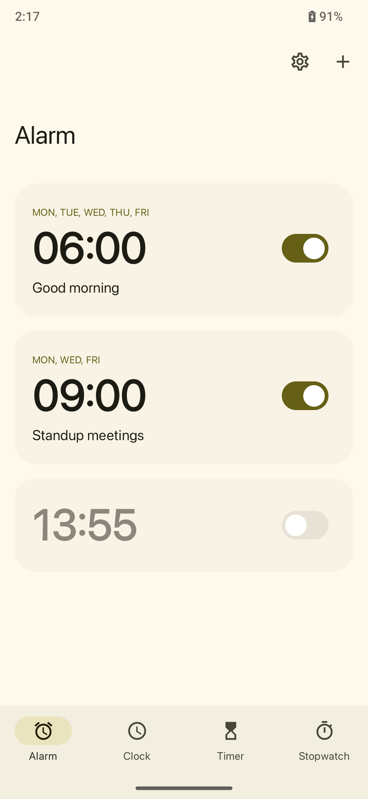
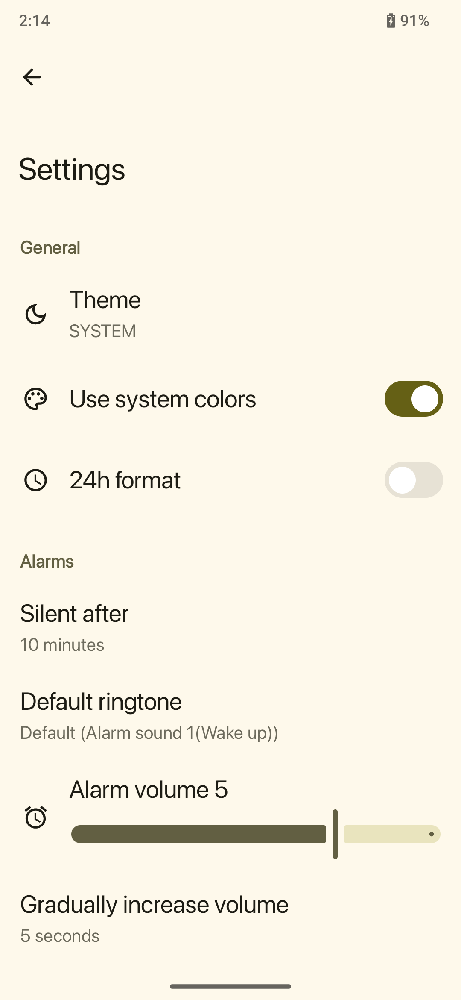

# ⏰ Android Simple Alarm

**Android Simple Alarm** is a lightweight, open-source alarm clock application for Android. It allows users to set, manage, and customize alarms with ease.

## 📱 Screenshots

  
  
  

